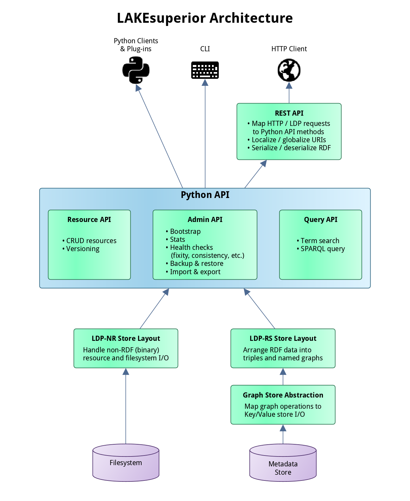

# LAKEsuperior Architecture

**DOCUMENTATION AND IMPLEMENTATION OF THIS SECTION ARE WORK-IN-PROGRESS!**

LAKEsuperior is written in Python. It is not excluded that parts of the code
may be rewritten in [Cython](http://cython.readthedocs.io/) for performance.

LAKEsuperior is accessible in multiple ways:

- Via HTTP. This is the canonical way to interact with LDP resources.
- Via command line. This method includes long-running admin tasks which are not
  available via HTTP.
- Via a Python API. This method allows to use Python scripts to access the same
  methods available to the two methods above in a programmatic way. It is
  possible to write Python plugins or even completely embed LAKEsuperior in a
  Python application.

