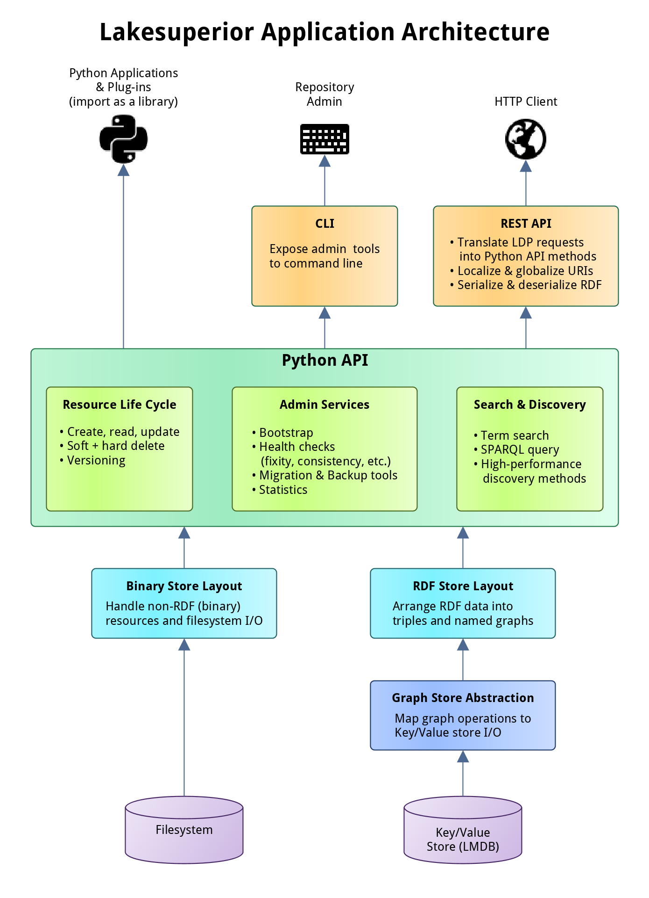

Lakesuperior Architecture
=========================

Lakesuperior is written in Python and `Cython
<http://cython.readthedocs.io/>`__; the latter for lower-level components that
interface with C basic data structures for maximum efficiency.

Aside from an optional dependency on a message queue server, Lakesuperior aims
at being self-contained. All persistence is done on an embedded database. This
allows a minimum memory and CPU footprint, and a high degree of scalability,
from :doc:`single-board computers <rpi>` to multi-core, high-load servers.

Inefficient applications "get the job done" by burning through CPU cycles,
memory, storage and electricity, and spew out great amounts of carbon and
digits on cloud provider bills. Lakesuperior strives to be mindful of that.

Multi-Modal Access
------------------

Lakesuperior services and data are accessible in multiple ways:

-  Via HTTP. This is the canonical way to interact with LDP resources
   and conforms quite closely to the Fedora specs (currently v4).
-  Via command line. This method includes long-running admin tasks which
   are not available via HTTP.
-  Via a Python API. This method allows to use Python scripts to access
   the same methods available to the two methods above in a programmatic
   way. It is possible to write Python plugins or even to embed
   Lakesuperior in a Python application, even without running a web
   server. Also, only this way it is possible to access some of the lower-level
   application layers that allow to skirt much heavy-handed data processing.

Architecture Overview
---------------------

   Lakesuperior Architecture

The Lakesuperior REST API provides access to the underlying Python API.
All REST and CLI operations can be replicated by a Python program
accessing this API.

The main advantage of the Python API is that it makes it very easy to
maipulate graph and binary data without the need to serialize or
deserialize native data structures. This matters when handling large ETL
jobs for example.

The Python API is divided in three main areas:

-  Resource API: this API in charge of all the resource CRUD operations and
   implements the majority of the Fedora specs.
-  Admin API: exposes utility methods, mostly long-running maintenance jobs.
-  Query API: provides several facilities for querying repository data.

See :doc:`API documentation<api>` for more details.
