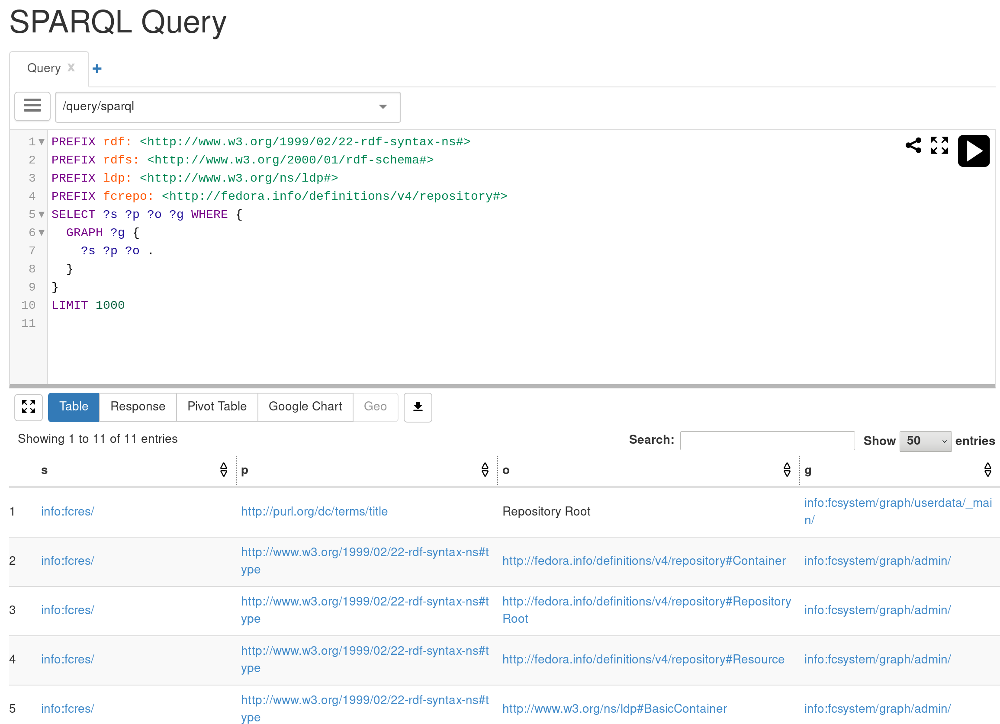

Resource Discovery & Query
==========================

LAKEsuperior offers several way to programmatically discover resources and
data.

LDP Traversal
-------------

The method compatible with the standard Fedora implementation and other LDP
servers is to simply traverse the LDP tree. While this offers the broadest
compatibility, it is quite expensive for the client, the server and the
developer.

For this method, please consult the dedicated `LDP specifications
<https://www.w3.org/TR/ldp/>`__ and `Fedora API specs
<https://wiki.duraspace.org/display/FEDORA4x/RESTful+HTTP+API+-+Containers>`__.

SPARQL Query
------------

A `SPARQL <https://www.w3.org/TR/sparql11-query/>`__ endpoint is available in
LAKEsuperior both as an API and a Web UI.

   LAKEsuperior SPARQL Query Window

The UI is based on `YasGUI <http://yasgui.org/>`__.

Note that:

#. The SPARQL endpoint only supports the SPARQL 1.1 Query language.
   SPARQL updates are not, and will not be, supported.
#. The LAKEshore data model has an added layer of structure that is not exposed
   through the LDP layer. The SPARQL endpoint exposes this low-level structure
   and it is beneficial to understand its layout. See :doc:`model` for details
   in this regard.
#. The underlying RDF structure is mostly in the RDF named graphs. Querying
   only triples will give a quite uncluttered view of the data, as close to the
   LDP representation as possible.

SPARQL Caveats
~~~~~~~~~~~~~~

The SPARQL query facility has not yet been tested thoroughly. the RDFLib
implementation that it is based upon can be quite efficient for certain
queries but has some downsides. For example, do **not** attempt the following
query in a graph with more than a few thousands resources::

    SELECT ?s {
      GRAPH ?g {
        <info:fcres/my-uid> ?p ?o .
      }
    }

What the RDFLib implementation does is going over every single graph in the
repository and perform the ``?s ?p ?o`` query on each of them. Since
LAKEsuperior creates several graphs per resource, this can run for a very long
time in any decently sized data set.

The solution to this is either to omit the graph query, or use a term search,
or a native Python method if applicable.

Term Search
-----------

This feature has not yet been implemented. It is meant to provide a discovery
tool based on simple term match, and possibly comparison. It should be more
efficient and predictable than SPARQL.

