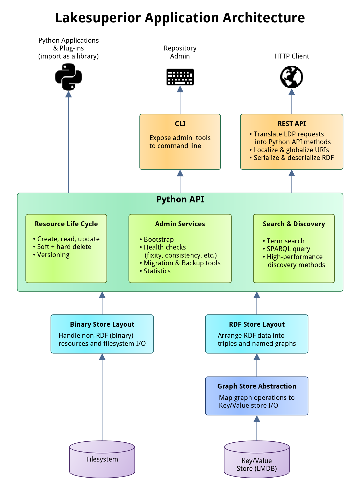

# LAKEsuperior Architecture

LAKEsuperior is written in Python. It is not excluded that parts of the code
may be rewritten in [Cython](http://cython.readthedocs.io/) for performance.

## Multi-Modal Access

LAKEsuperior services and data are accessible in multiple ways:

- Via HTTP. This is the canonical way to interact with LDP resources and
  conforms quite closely to the Fedora specs (currently v4).
- Via command line. This method includes long-running admin tasks which are not
  available via HTTP.
- Via a Python API. This method allows to use Python scripts to access the same
  methods available to the two methods above in a programmatic way. It is
  possible to write Python plugins or even to embed LAKEsuperior in a
  Python application, even without running a web server.

## Architecture Overview

The LAKEsuperior REST API provides access to the underlying Python API. All
REST and CLI operations can be replicated by a Python program accessing this
API.

The main advantage of the Python API is that it makes it very easy to maipulate
graph and binary data without the need to serialize or deserialize native data
structures. This matters when handling large ETL jobs for example.

The Python API is divided in three main areas:

- [Resource API](../../lakesuperior/api/resource.py). This API is in charge of
  all the resource CRUD operations and implements the majority of the Fedora
  specs.
- [Admin API](../../lakesuperior/api/admin.py). This exposes utility methods,
  mostly long-running maintenance jobs.
- [Query API](../../lakesuperior/api/query.py). This provides several
  facilities for querying repository data.

