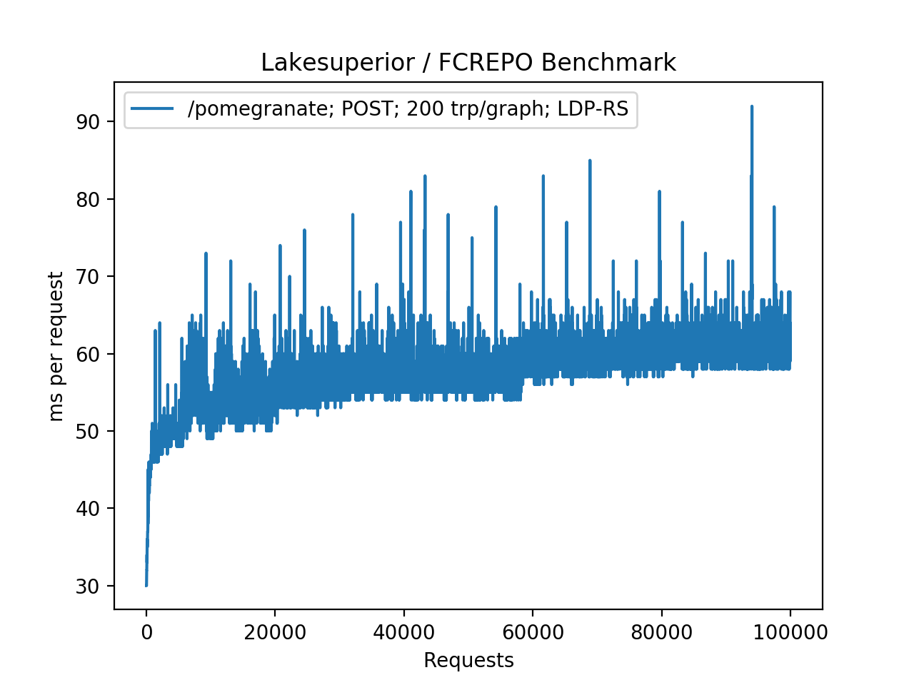

Performance Benchmark Report
============================

The purpose of this document is to provide very broad performance measurements
and comparison between Lakesuperior and Fedora/Modeshape implementations.

Environment
-----------

Hardware
~~~~~~~~

-  MacBook Pro14,2
-  1x Intel(R) Core(TM) i5 @3.1Ghz
-  16Gb RAM
-  SSD
-  OS X 10.13
-  Python 3.7.2
-  lmdb 0.9.22

Benchmark script
~~~~~~~~~~~~~~~~

`Source code <../../util/benchmark.py>`__

The script was run by generating 100,000 children under the same parent. PUT
and POST requests were tested separately.  The POST method produced pairtrees
in Fedora to counter its known issue with many resources as direct children of
a container.

The script calculates only the timings used for the PUT or POST requests, not
counting the time used to generate the random data.

Data Set
~~~~~~~~

Synthetic graph created by the benchmark script. The graph is unique for
each request and consists of 200 triples which are partly random data,
with a consistent size and variation:

-  50 triples have an object that is a URI of an external resource (50
   unique predicates; 5 unique objects).
-  50 triples have an object that is a URI of a repository-managed
   resource (50 unique predicates; 5 unique objects).
-  100 triples have an object that is a 64-character random Unicode
   string (50 unique predicates; 100 unique objects).

The benchmark script is also capable of generating random binaries and a mix of
binary and RDF resources; a large-scale benchmark, however, was impractical at
the moment due to storage constraints.

LDP Data Retrieval
~~~~~~~~~~~~~~~~~~

REST API request::

   time curl http://localhost:8000/ldp/pomegranate > /dev/null

SPARQL Query
~~~~~~~~~~~~

The following query was used against the repository after the 100K resource
ingest::

   PREFIX ldp: <http://www.w3.org/ns/ldp#>
   SELECT (COUNT(?s) AS ?c) WHERE {
     ?s a ldp:Resource .
     ?s a ldp:Container .
   }

Raw request::

   time curl -iXPOST -H'Accept:application/sparql-results+json' \
   -H'Content-Type:application/x-www-form-urlencoded; charset=UTF-8' \
   -d 'query=PREFIX+ldp:+<http://www.w3.org/ns/ldp#> SELECT+(COUNT(?s)+AS+?c)'\
   '+WHERE+{ ++?s+a+ldp:Resource+. ++?s+a+ldp:Container+. }+' \
   http://localhost:5000/query/sparql

Python API Retrieval
~~~~~~~~~~~~~~~~~~~~

In order to illustrate the advantages of the Python API, a sample retrieval of
the container resource after the load has been timed. This was done in an
IPython console::

   In [1]: from lakesuperior import env_setup
   In [2]: from lakesuperior.api import resource as rsrc_api
   In [3]: %timeit x = rsrc_api.get('/pomegranate').imr.as_rdflib()

Results
-------

===================  ===============  ================  =============  ====================  ==============
Software             PUT              POST              Store Size     GET                   SPARQL Query  
===================  ===============  ================  =============  ====================  ==============
FCREPO 5.0.2         >500ms [#]_      65ms (100%) [#]_  12Gb (100%)    3m41s (100%)          N/A           
Lakesuperior REST    104ms (100%)     123ms (189%)      8.7Gb (72%)    30s (14%)             19.3s (100%)  
Lakesuperior Python  69ms (60%)       58ms (89%)        8.7Gb (72%)    6.7s (3%) [#]_ [#]_   9.17s (47%)
===================  ===============  ================  =============  ====================  ==============

.. [#] POST was stopped at 30K resources after the ingest time reached >1s per
    resource. This is the manifestation of the "many members" issue which is
    visible in the graph below. The "Store" value is for the PUT operation
    which ran regularly with 100K resources.

.. [#] the POST test with 100K resources was conducted with fedora 4.7.5
    because 5.0 would not automatically create a pairtree, thereby resulting
    in the same performance as the PUT method.

.. [#] Timing based on a warm cache. The first query timed at 22.2s.

.. [#] The Python API time for the "GET request" (retrieval) without the
    conversion to Python in alpha20 is 3.2 seconds, versus the 6.7s that
    includes conversion to Python/RDFlib objects. This can be improved by
    using more efficient libraries that allow serialization and
    deserialization of RDF.

Charts
------

.. figure:: assets/plot_fcrepo_put_100K.png
   :alt: Fedora with PUT, 100K request time chart

   Fedora/Modeshape using PUT requests under the same parent. The "many
   members" issue is clearly visible after a threshold is reached.

.. figure:: assets/plot_fcrepo_post_100K.png
   :alt: Fedora with POST, 100K request time chart

   Fedora/Modeshape using POST requests generating pairtrees. The performance
   is greatly improved, however the ingest time increases linearly with the
   repository size (O(n) time complexity)

   Lakesuperior using POST requests, NOT generating pairtrees (equivalent to
   a PUT request). The timing increase is closer to a O(log n) pattern.

   Lakesuperior using Python API. The pattern is much smoother, with less
   frequent and less pronounced spikes. The O(log n) performance is more
   clearly visile here: time increases quickly at the beginning, then slows
   down as the repository size increases.

Conclusions
-----------

Lakesuperior appears to be slower on writes and much faster on reads than
Fedora 4-5. Both these factors are very likely related to the underlying LMDB
store which is optimized for read performance. The write performance gap is
more than filled when ingesting via the Python API.

In a real-world application scenario, in which a client may perform multiple
reads before and after storing resources, the write performance gap may
decrease. A Python application using the Python API for querying and writing
would experience a dramatic improvement in read as well as write timings.

As it may be obvious, these are only very partial and specific
results. They should not be taken as a thorough performance assessment, but
rather as a starting point to which specific use-case variables may be added.
