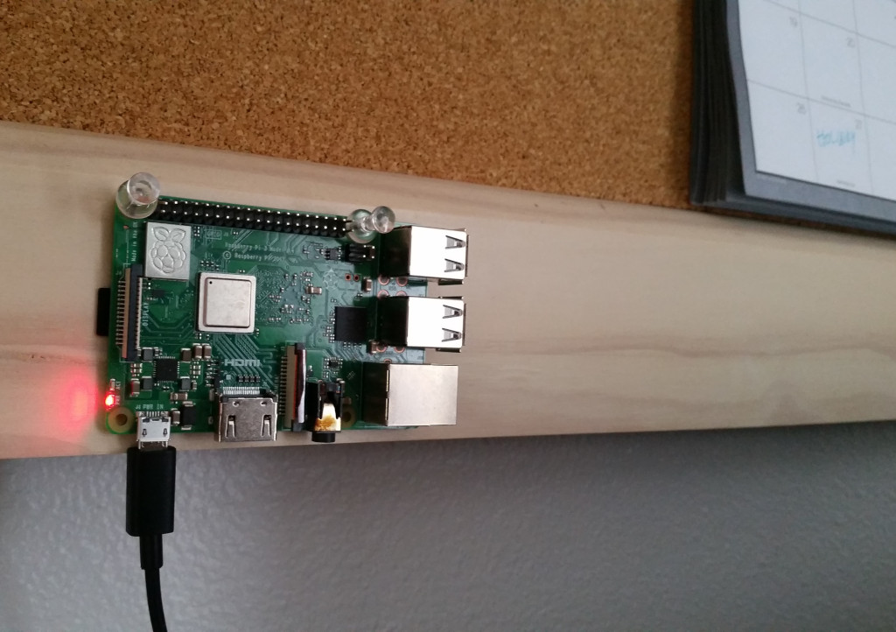

Lakesuperior on a Raspberry Pi
==============================

   Look, a Fedora implementation!

**Experiment in Progress**

Lakesuperior has been successfully installed and ran on a Raspberry Pi 3 board.
The software was compiled on Alpine Linux using `musl <http://musl-libc.org>`__
C libraries. (it also run fine with musl on more conventional hardware, but
performance benchmarks vis-a-vis libc have not been performed yet.)

Performance is obviously much lower than even a consumer-grade laptop, however
the low cost of single-board computers may open up Lakesuperior to new
applications that may require to connect many small LDP micro-repositories.

If this experiment proves worthwhile, a disk image contianing the full system
can be made available. The image would be flashed to a microSD card and
inserted into a Raspberry Pi for a ready-to-use system.

Some tweaks to the software could be made to better adapt it to small
repositories. For example, adding a cpmpile-time option to force the use of
fixed 32-bit keys on an ARM64 processor rather than the current 64-bit keys (a
32-bit system would use 32-bit keys natively), it would be possible for
Lakesuperior to handle half-sized indices and still being capable of holding,
in theory, millions of triples.

Cell phones next?

More to come on the topic.

